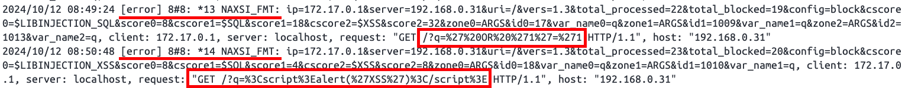

# NGINX XSS 및 SQL 인젝션 방지

NAXSI는 오픈 소스의 고성능, 낮은 유지 보수의 웹 애플리케이션 방화벽(WAF)입니다. 이 Docker 이미지는 [공식 Nginx 이미지](https://hub.docker.com/_/nginx)를 기반으로 NAXSI 모듈을 추가하고, 불필요한 모듈을 제거하여 맞춤화한 버전입니다.

이 저장소는 **Alpine에서의 Nginx 메인라인**을 지원합니다.

## 사용 방법

1. **Docker 이미지 빌드**

   프로젝트의 루트 디렉토리로 이동하여 다음 명령을 실행합니다:

   ```bash
   docker build -t nginx-naxsi .
   ```

2. **Docker 컨테이너 실행**

   빌드한 이미지를 사용하여 Docker 컨테이너를 실행합니다:

   ```bash
   docker run --name nginx-naxsi -p 80:80 -d nginx-naxsi
   ```

3. **테스트**

   웹 브라우저를 열고 `http://<your-ip>`를 방문하여 Nginx 서버가 실행 중인지 확인합니다. NAXSI가 올바르게 작동하는지 확인하기 위해, 테스트 요청을 보낼 수 있습니다. 예를 들어, 간단한 XSS 공격 요청을 시도해 볼 수 있습니다:

   ```bash
   http://<your-ip>?q=<script>alert('XSS')</script>
   http://<your-ip>?q=' OR '1'='1' --
   ...
   ```

   - localhost(http://localhost)로 접근하면 NAXSI에 의해 차단되므로 IP 주소를 사용하여 접근해야 합니다.
   - 테스트 시, `naxsi.rules` 파일에서 LearningMode가 활성화되어 있다면 Naxsi가 학습 모드에 들어가 공격을 차단하지 않으므로, 테스트를 위해 LearningMode를 비활성화해야 합니다.

4. **들어오는 요청이 차단되었는지 확인**

   ```bash
   cat /var/log/nginx/naxsi.log
   ```

   결과

   
