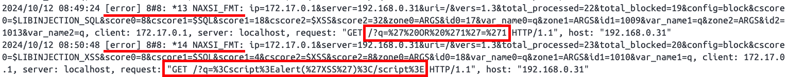

# NGINX Anti XSS & SQL Injection

[Read in Korean](README.ko.md)

NAXSI is an open-source, high-performance, low-maintenance web application firewall (WAF). This Docker image is a customized version of the [official Nginx image](https://hub.docker.com/_/nginx), with the NAXSI module added and unnecessary modules from the official image removed.

This repository supports **nginx mainline on Alpine**.

## Usage

1. **Build the Docker Image**

   Navigate to the root directory of your project and execute the following command:

   ```bash
   docker build -t nginx-naxsi .
   ```

2. **Run the Docker Container**

   Run the Docker container using the built image:

   ```bash
   docker run --name nginx-naxsi -p 80:80 -d nginx-naxsi
   ```

3. **Test**

   Open a web browser and navigate to `http://<your-ip>` to ensure the Nginx server is running. To confirm that NAXSI is functioning correctly, send a test request. For example, you can try a simple XSS attack request like:

   ```bash
   http://<your-ip>?q=<script>alert('XSS')</script>
   http://<your-ip>?q=' OR '1'='1' --
   ...
   ```

   - If you access http://localhost, you will be blocked by NAXSI, so you need to access it using your IP address.
   - When testing, if LearningMode is enabled in the naxsi.rules file, Naxsi will enter learning mode and will not block attacks, so please disable LearningMode during testing

4. **Check if the incoming request is blocked.**

   ```bash
   cat /var/log/nginx/naxsi.log
   ```

   Result

   
